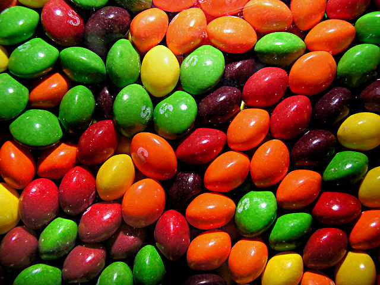
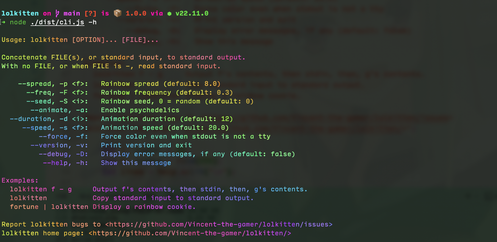

# lolkitten

[![npm version][npm-version-src]][npm-version-href]

The Skittles I tasted. :) 

Inspired by [busyloop/lolcat](https://github.com/busyloop/lolcat)



## Installation

### From `npm`

```shell
npm i @vincent-the-gamer/lolkitten -g
```

### From `jsr`
Soon. Trying to release a CLI package on jsr.

## Usage
```shell
lolkitten -h

# Or through pipe
echo "hello world!" | lolkitten
```

## Preview




## License

[MIT](./LICENSE) License © 2024-PRESENT [Vincent-the-gamer](https://github.com/Vincent-the-gamer)

<!-- Badges -->

[npm-version-src]: https://img.shields.io/npm/v/@vincent-the-gamer/lolkitten?style=flat&colorA=080f12&colorB=1fa669
[npm-version-href]: https://npmjs.com/package/