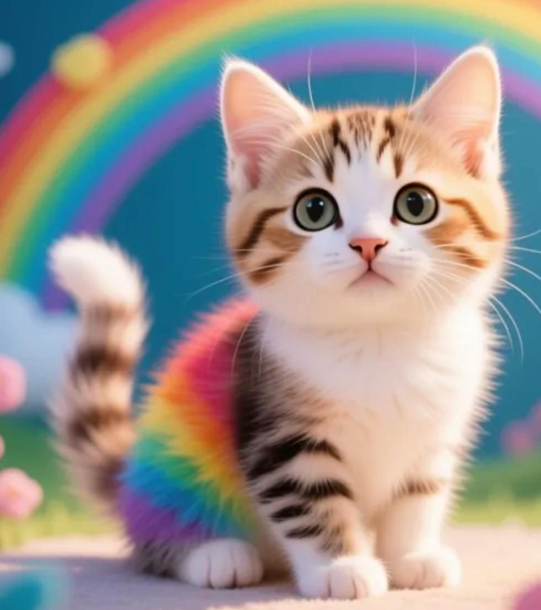

<div align="center">
    
    <p>lolkitten</p>
    <p><i>Rustified lolcat</i></p>
</div>

🌈 A lightweight and fast the-rainbow-cat-inspired text colorizer.

## ✨ Features

- **Rainbow Gradient Effect** - Automatically applies smooth rainbow color transitions across your text
- **ANSI Escape Code Support** - Preserves non-color ANSI escape codes (like cursor movements) while filtering out color codes
- **True Color Support** - Uses full 24-bit RGB color space for vibrant, smooth gradients
- **Character-Level Colorization** - Each character gets its own calculated color for a seamless gradient effect
- **Performance** - Written in Rust for fast execution and minimal memory overhead
- **Zero Dependencies** - lightweight implementation with only standard library dependencies

## 🚀 Installation

### From Release

Download from GitHub Release

### From Source

```bash
# Clone the repository
git clone https://github.com/Vincent-the-gamer/lolkitten.git
cd lolkitten

# Build and install
cargo install --path .
```

## Usage

### Basic Usage

Pipe any output to `lolkitten` to add rainbow colors:

```bash
echo "Hello, World!" | lolkitten
```

### Colorize Script Output

```bash
cat script.sh | lolkitten
```

### Colorize Files

```bash
cat README.md | lolkitten
```

### Combine with Other Commands

```bash
ls -la | lolkitten
ps aux | lolkitten
history | lolkitten
```

# License

[MIT License | Vincent-the-gamer | @2026-PRESENT](./LICENSE)
