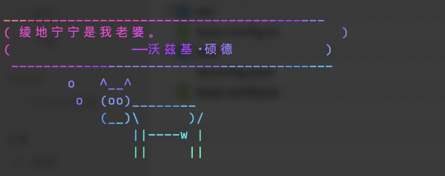

# lolkitten

[![npm version][npm-version-src]][npm-version-href]
[![npm downloads][npm-downloads-src]][npm-downloads-href]
[![bundle][bundle-src]][bundle-href]
[![JSDocs][jsdocs-src]][jsdocs-href]
[![License][license-src]][license-href]

The Skittles I tasted. :) 

Inspired by [busyloop/lolcat](https://github.com/busyloop/lolcat)


## Installation

### From `npm`


```shell
npm i @vincent-the-gamer/lolkitten -g
```

### Usage
```shell
lolkitten -h

# Or through pipe
neofetch | lolkitten
```

### From `jsr`
Soon.

## Preview




## License

[MIT](./LICENSE) License © 2024-PRESENT [Vincent-the-gamer](https://github.com/Vincent-the-gamer)

<!-- Badges -->

[npm-version-src]: https://img.shields.io/npm/v/@vincent-the-gamer/lolkitten?style=flat&colorA=080f12&colorB=1fa669
[npm-version-href]: https://npmjs.com/package/
[npm-version-src]: https://img.shields.io/npm/v/@vincent-the-gamer/lolkitten
[npm-downloads-src]: https://img.shields.io/npm/dm/
[npm-version-src]: https://img.shields.io/npm/v/@vincent-the-gamer/lolkitten?style=flat&colorA=080f12&colorB=1fa669
[npm-downloads-href]: https://npmjs.com/package/
[npm-version-src]: https://img.shields.io/npm/v/@vincent-the-gamer/
[npm-version-src]: https://img.shields.io/npm/v/@vincent-the-gamer/lolkitten
[bundle-src]: https://img.shields.io/bundlephobia/minzip/
[npm-version-src]: https://img.shields.io/npm/v/@vincent-the-gamer/lolkitten?style=flat&colorA=080f12&colorB=1fa669&label=minzip
[bundle-href]: https://bundlephobia.com/result?p=
[npm-version-src]: https://img.shields.io/npm/v/@vincent-the-gamer/lolkitten
[license-src]: https://img.shields.io/github/license/Vincent-the-gamer/
[npm-version-src]: https://img.shields.io/npm/v/@vincent-the-gamer/lolkitten.svg?style=flat&colorA=080f12&colorB=1fa669
[license-href]: https://github.com/Vincent-the-gamer/
[npm-version-src]: https://img.shields.io/npm/v/@vincent-the-gamer/lolkitten/blob/main/LICENSE
[jsdocs-src]: https://img.shields.io/badge/jsdocs-reference-080f12?style=flat&colorA=080f12&colorB=1fa669
[jsdocs-href]: https://www.jsdocs.io/package/
[npm-version-src]: https://img.shields.io/npm/v/@vincent-the-gamer/lolkitten